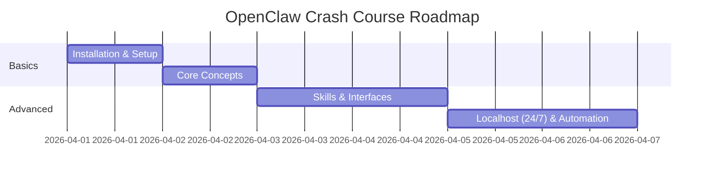

# 03 Course Roadmap: Your Journey to Becoming an OpenClaw Master

Welcome to the roadmap! This isn't just a list of chapters; it's a mission plan. Over the next 16 chapters, we are going to move fast. We’ll go from a blank terminal to a fully-functioning, 24/7 digital assistant.

Here is what the journey looks like.

---

## 🗺️ The Roadmap Breakdown

### Phase 1: The Foundations (Chapters 1 - 5)
In this phase, we get our hands dirty. 
*   **The Big Picture**: Understanding why agents are the future.
*   **The Setup**: Installing OpenClaw on your local machine (Mac or Windows).
*   **The Brain**: Choosing your AI models (Gemini vs. OpenAI) and setting up your API keys.

### Phase 2: Connecting to the World (Chapters 6 - 9)
Once the brain is ready, we need to give it a voice.
*   **The Channels**: Connecting to Telegram, WhatsApp, and Discord.
*   **The Interfaces**: Exploring the Web UI, the command-line TUI, and the Desktop app.
*   **The Architecture**: Deep-diving into how "Gateways" and "Agents" communicate.

### Phase 3: Giving the AI "Hands" (Chapters 10 - 13)
Now we make the AI actually *do* things.
*   **Personalization**: Configuring the "Identity" and "Soul" of your agent.
*   **Skill Mastery**: Understanding the Model Context Protocol (MCP) and managing built-in skills.
*   **Customization**: Writing your own Python-based skills to solve specific problems.
*   **Web Knowledge**: Giving your AI the ability to search the live internet with Tavily.

### Phase 4: Pro-Level Automation (Chapters 14 - 19)
The final stage is scaling your assistant so it’s always working for you.
*   **Localhost Persistence**: Keeping your agent alive 24/7 on your own machine.
*   **Cron Jobs**: Setting up automated tasks (like a daily news digest).
*   **Multi-Agent Flows**: Creating a system where different agents handle different parts of your life.
*   **The Final Project**: Building a Daily Assistant Digest that pings you every morning.

---

## 📅 Visualize the Schedule
Here is how we’ve paced out these topics to take you from Zero to Hero in record time:

View Mermaid Source

---

## 💡 Why This Order?
We start with local installation because it’s important to see it working on your own hardware first. Once you understand the security implications and the core feel of the tool, managing local persistence (Chapter 8) becomes much more intuitive.

**Next Lesson:** It’s time to stop talking and start building. Let’s get OpenClaw installed on your machine!
