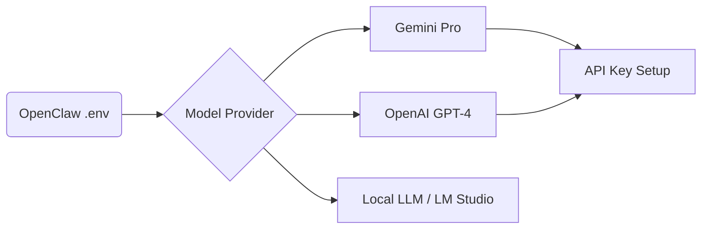

# 05 Choosing Your Assistant’s Brain (Models & API Keys)

OpenClaw is "model-agnostic," meaning you can give it almost any AI brain you want. Whether you want the power of OpenAI, the huge context window of Anthropic, or the free tier friendliness of Google Gemini, OpenClaw can handle it.

---

## 🧠 Why Gemini 2.5 Flash?
In this course, we are going to use **Google Gemini 2.5 Flash**. 

**Why Flash?**
1.  **It’s Free**: You can get an API key from Google AI Studio without even putting in a credit card.
2.  **It’s Fast**: It provides incredibly quick responses for everyday tasks.
3.  **High Request Limits**: Even in the free tier, it allows for a lot of requests—perfect for a "Zero to Hero" experiment.

---

## 🔑 How to Get Your API Key

1.  **Google AI Studio**: Head over to [Google AI Studio](https://aistudio.google.com/).
2.  **Create Key**: Click on "Get API Key" and create one in a new project.
3.  **Copy It**: You’ll need this string of letters and numbers for the setup.

---

## 🏗️ Adding the Key to OpenClaw

When you run the onboard command (we'll see this in the next chapter), OpenClaw will ask for your key. Behind the scenes, it saves these keys in your profile configuration. 

If you ever want to check or change your keys manually, they are typically stored in:
`~/.openclaw/profiles/main/config.json` (on Mac)
`C:\Users\<YourUser>\.openclaw\profiles\main\config.json` (on Windows)

### Pro Tip: The .env Template
If you are developing your own skills or running OpenClaw manually, you might use a `.env` file. It looks like this:

```bash
# Example .env Configuration
GOOGLE_GENERATIVE_AI_API_KEY=YOUR_GEMINI_KEY_HERE
OPENAI_API_KEY=YOUR_OPENAI_KEY_HERE
ANTHROPIC_API_KEY=YOUR_CLAUDE_KEY_HERE
```

---

## 🗺️ Model Choice Visualization
Here is how OpenClaw handles different model providers:

<details>
<summary>View Mermaid Source</summary>




</details>

---

## ⚡ Fallback Models
One cool feature of OpenClaw is the **Fallback Model**. If your primary model (like GPT-4) fails because you ran out of credits, OpenClaw can automatically switch to a cheaper fallback (like Gemini Flash) so your agent stays alive!

**Next Step:** Now that we have a brain, let's give it a channel to talk through—Telegram and WhatsApp!
