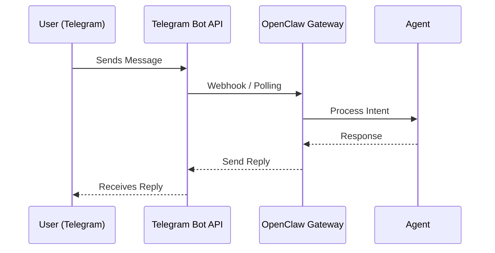

# 06 Connecting Channels: Telegram & WhatsApp

Now that OpenClaw has a "brain," it needs a way to communicate with you! Instead of having to open a terminal every time you want to talk to your assistant, we are going to connect it to your favorite messaging apps.

---

## 🤖 Option 1: Telegram (Highly Recommended)
Telegram is the easiest and most stable way to use OpenClaw. You’ll be creating your own private bot that only you (and people you authorize) can use.

### How to Set Up:
1.  **Search BotFather**: Open Telegram and search for `@BotFather`.
2.  **Start the Bot**: Click "Start" and send `/newbot`.
3.  **Name Your Bot**: Give it a name (e.g., "My Claw Assistant").
4.  **Set a Username**: It must end in `bot` (e.g., `my_claw_007_bot`).
5.  **Get Your Token**: BotFather will give you a long string called an "API Token." **Keep this secret!**

---

## 📱 Option 2: WhatsApp (Beta)
You can also chat with OpenClaw on WhatsApp. This works just like WhatsApp Web.

### How to Set Up:
1.  When configuring OpenClaw, select the **WhatsApp** channel.
2.  Your terminal will display a **QR Code**.
3.  Open WhatsApp on your phone -> Settings -> Linked Devices -> Link a Device.
4.  **Scan the QR code** in your terminal.

> [!CAUTION]
> **Security Warning**: Unlike Telegram, connecting your personal WhatsApp account has higher security risks. I recommend disconnecting the device whenever you aren't actively testing if you are using your main personal number.

---

## 🛠️ The Pairing Process
Once you have your Telegram token, run the following command in your terminal if you aren't already in the setup:

```bash
openclaw onboard
```

1.  Select **Telegram** as your channel. 
2.  Paste your **Token**.
3.  Open your new bot on Telegram and type `/start`.
4.  The bot will give you a **Pairing Code**. 
5.  Enter that code back in your terminal to "pair" your identity with the bot.

---

## 🗺️ How the Message Travels
Here is the journey of a single "Hello" from your phone to OpenClaw:

<details>
<summary>View Mermaid Source</summary>




</details>

---

## ✅ You Are Now Interactive!
If you’ve followed these steps, you should be able to send a message on Telegram and get a response back from your AI. 

**Next Chapter:** Let's look at the "Three Musketeers" of OpenClaw: Gateway, Agents, and Skills, and see how they work together under the hood!
