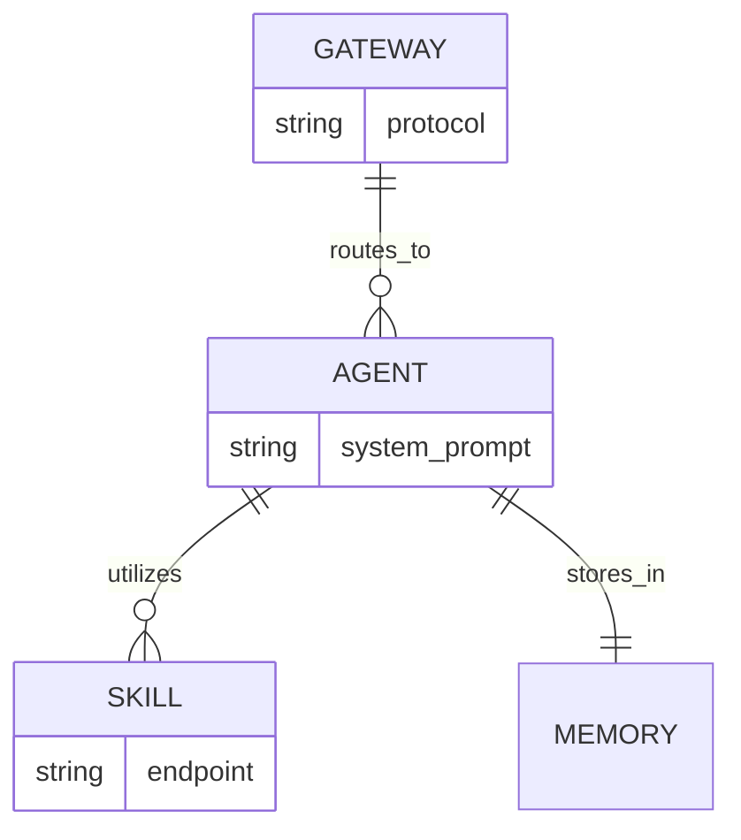

# 07 The Three Musketeers: Gateway, Agents & Skills

To truly master OpenClaw, you need to understand how its "internal organs" work together. We call them the **Three Musketeers**: the Gateway, the Agent, and the Skills. 

Think of this whole system as a **Digital Intern** you’ve just hired. Here is how that intern is structured:

---

## 🏗️ 1. The Gateway (The Communication Hub)
The Gateway is the "front desk" of your assistant. Its only job is to handle messages coming in from Telegram, WhatsApp, or the Web UI and route them to the right Agent.
*   **Routing**: It knows that a message from *you* should go to *your* personal agent.
*   **Translation**: It converts Telegram messages into a format the AI can understand.
*   **Service Runtime**: In your local setup, this runs as a background process using NodeJS.

## 🧠 2. The Agent (The Decision Maker)
The Agent is the "brain." It doesn't just reply to text; it **thinks in loops**.
*   **Identity & Soul**: It looks at your `identity.md` and `soul.md` to remember who it is and how it should talk to you.
*   **Planning**: When you ask, "What's the weather like for my meeting?", the Agent realizes it needs to check two things: your calendar and a weather API.
*   **Memory**: It saves your preferences and past conversations so it gets smarter over time.

## 🛠️ 3. Skills & MCP (The Functional Tools)
If the Agent is the brain, the Skills are the **hands**. 
*   **Model Context Protocol (MCP)**: This is a standardized way for AI agents to "pick up" tools. 
*   **Plugin System**: You can add skills for Google Search, Notion, Slack, or even custom Python scripts.
*   **Example**: When the Agent needs to perform a task (like checking a file), it "calls" a skill, gets the result, and then reports back to you.

---

## 🔄 The Relationship Diagram
Here is how these three components are linked together:

View Mermaid Source

---

## ⚡ Why This Separation Matters?
Because the Gateway is separate from the Agent, you can have **one Gateway** connected to **multiple Agents**. For example:
*   **Agent A**: Your Work Assistant (connected to Slack & Outlook).
*   **Agent B**: Your Personal Assistant (connected to WhatsApp & Apple Notes).

They both run through the same OpenClaw system but have completely different personalities and skills!

**Next Lesson:** Tired of your agent going offline when you close your laptop? Let's move OpenClaw to a Localhost (24/7) for 24/7 automation!
