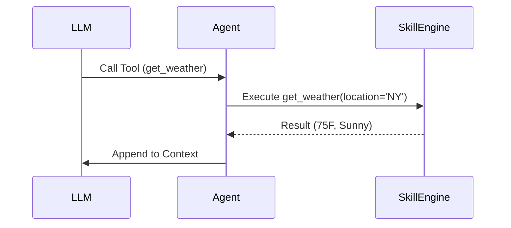

# 11 Creating & Managing Skills: Giving Your AI "Hands"

Skills are what turn OpenClaw from a "chatbot" into a "digital intern." While the AI (Agent) can think and reason, **Skills** are specialized tools that let it interact with the outside world.

---

## 🛠️ What are Skills?
A Skill is a small, modular piece of code that does one thing very well. It could be:
*   **Searching Google**: For finding the latest news.
*   **Managing Email**: Sending, reading, or archiving Gmail.
*   **Calendar Management**: Checking your availability for a meeting.
*   **System Controls**: Reading or writing files on your computer.

---

## 🌍 The MCP (Model Context Protocol)
Most of OpenClaw's skills use a new standard called the **Model Context Protocol (MCP)**. This is a common language that allows any AI agent to "talk" to any tool. 

When you were setting up OpenClaw, you saw it installing things like `mcp-potter` or `clawhub`. These are collections of skills that the agent can "pick up" whenever it needs to solve a problem for you.

---

## ⚙️ How to Manage Your Skills
You don't need to be a coder to manage your agent's skills. 

1.  **Open the Web UI**: Use `openclaw web`.
2.  **Go to the Skills Tab**: Here you will see a list of every skill currently available to your agent.
3.  **Toggle on/off**: If you don't want your agent to have access to your files, you can simply toggle that skill off!

### 🔑 Skills with API Keys
Some skills require their own authentication. For example:
*   **Tavily Search**: Needs a Tavily API key.
*   **Google Maps**: Needs a Google Places API key.
*   **Notion**: Needs a Notion Integration token.

OpenClaw will prompt you for these keys when you first try to enable the skill.

---

## 🔄 The Tool Execution Flow
Here is the step-by-step process of how your agent uses a skill:

View Mermaid Source

---

## ✅ Skills Success Check
Try asking your agent: *"What skills do you currently have?"*
It should list the tools it can access, like searching the web or checking system status.

**Next Lesson:** Ready to build something unique? Let’s learn how to create your very own **Custom Skill**!
