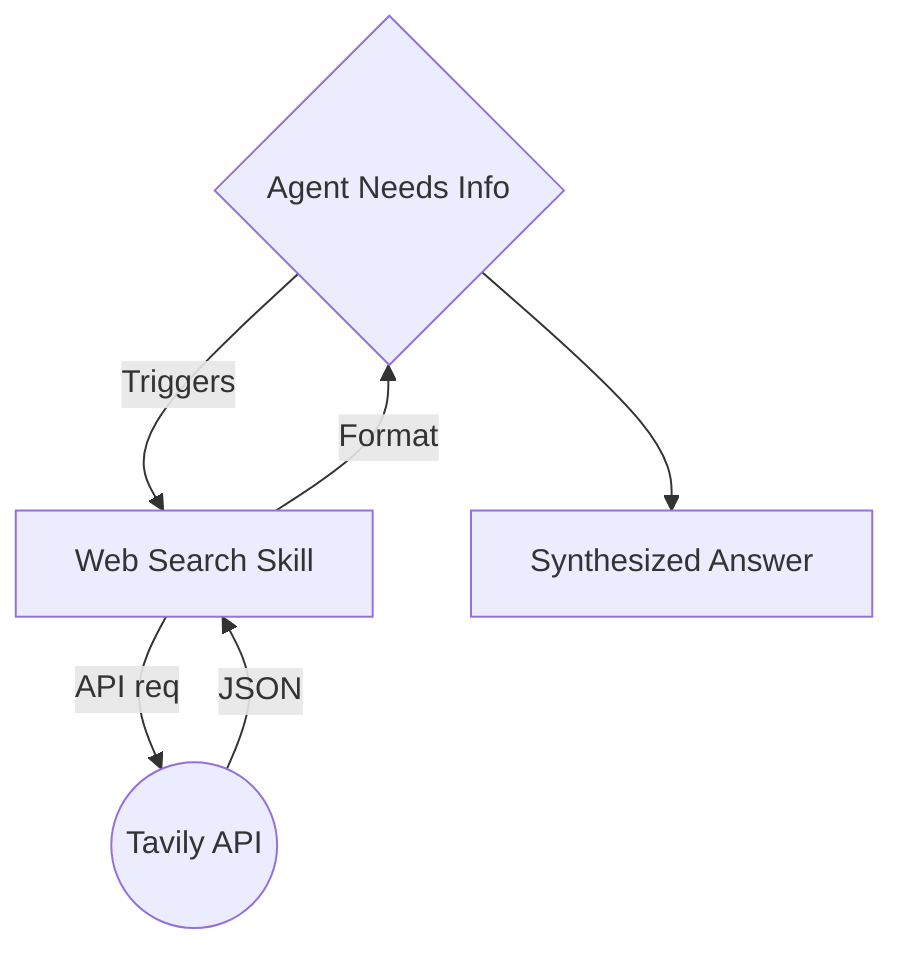

# 13 Web Search: Giving Your AI "Real-Time" Knowledge

A static AI only knows things up to its training date. But an OpenClaw agent with **Web Search** knows what happened five minutes ago. In this chapter, we’re going to give your agent the power of the live internet using the **Tavily API**.

---

## 🌐 Why Tavily Instead of Google?
While you can use Google or Bing, **Tavily** is built specifically for AI agents. 
*   **No Clutter**: It doesn't return ads or SEO-spam; it returns clean, factual text that LLMs love.
*   **Search and Retrieval**: It can search thousands of pages and pull out only the specific paragraph your agent needs.
*   **JSON Optimized**: The data format is perfect for the OpenClaw "Skill" pipeline.

---

## 🔑 Setting Up Tavily
1.  **Get a Key**: Go to [Tavily.com](https://tavily.com/) and sign up for a free developer account.
2.  **Copy the API Key**: You’ll get a string starting with `tvly-...`.
3.  **Enable the Skill**: In your OpenClaw command line or Web UI:
    *   Find the `tavily-search` or `web-search` skill.
    *   Enter your API key when prompted.
    *   Restart your agent.

---

## 🔄 The Search Loop
Here is how your agent uses search to fact-check its answers in real-time:

View Mermaid Source

---

## ✅ Web Search Success Check
Once enabled, try asking your agent something very recent, like:
*"What is the current stock price of NVIDIA?"* or *"Who won the sports game last night?"*

If the agent says it’s "using search," you’ve successfully given it eyes on the world!

**Next Lesson:** Now that your agent can search, let’s learn how to make it **proactive** using Cron Jobs and Heartbeats!
