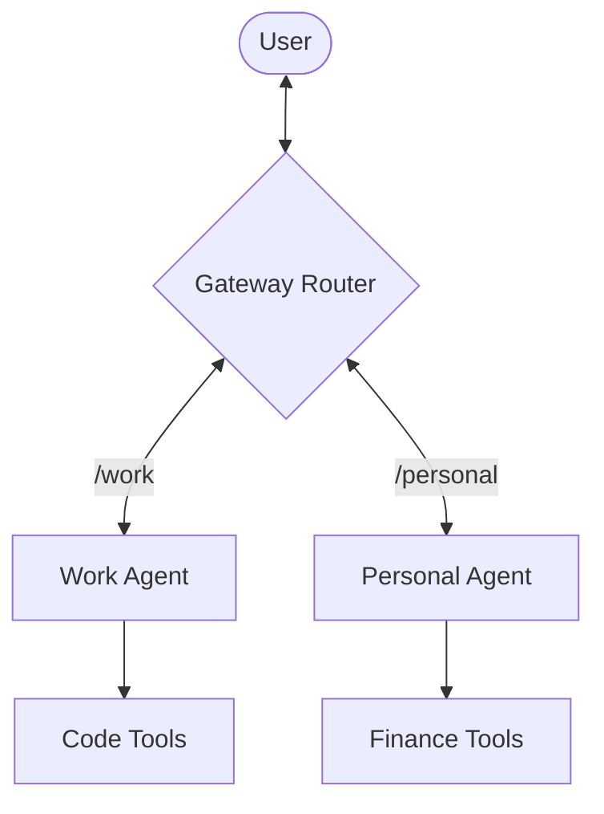

# 15 Scaling Up: Multi-Agent Architecture (Work vs. Personal)

As you use your assistant more, you’ll find it’s hard for one single AI brain to handle everything. Your "Work Brain" needs access to Slack and your work calendar. Your "Personal Brain" needs your grocery list and workout schedule.

Mixing these causes **Context Contamination**. In this chapter, we’re going to learn how to run multiple agents on a single OpenClaw Gateway.

---

## 🏗️ The Multi-Agent Concept
OpenClaw allows you to create separate "Profiles" for different areas of your life. 

### Why run separate agents?
*   **Privacy**: Your work agent doesn't need to know about your bank balance.
*   **Precision**: A coding-focused agent will have different instructions (Soul) than a life-coaching agent.
*   **Safety**: You can restrict specific skills (like deleting files) to only your "Work" agent while leaving your "Personal" agent more relaxed.

---

## 🛠️ Setting Up Your Second Agent
1.  **Profiles**: Each agent gets its own directory in `.openclaw/profiles/`.
2.  **Unique Identity**: Give each one a separate name in its `identity.md`.
3.  **Routing**: Tell the Gateway which agent to trigger. For example, messages from Slack go to "Work Agent," while messages from WhatsApp go to "Personal Agent."

### ⌨️ TUI Command:
In the Terminal UI, you can see all your active agents by typing:
```bash
/agents
```
And switch between them instantly!

---

## 🗺️ Multi-Agent Interaction Diagram
Here is how the Gateway acts as a router between your different digital clones:

<details>
<summary>View Mermaid Source</summary>




</details>

---

## ✅ Multi-Agent Success Check
Once you’ve set up two agents, try sending a message to each one from different channels. Your "Work Agent" should recognize you from Slack, while your "Personal Agent" should respond to you on WhatsApp—both sharing the same OpenClaw engine in the background!

**Next Lesson (The Project):** It’s time to bring everything together. We are going to build a **Daily Telegram Assistant** that uses all the skills we’ve learned!
