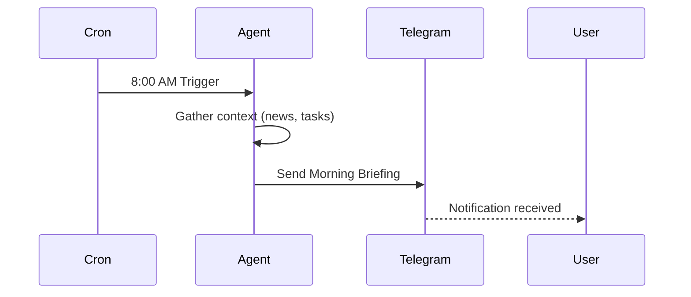

# 16 Project: Your 24/7 Daily Telegram Assistant

It’s time to bring everything together! We have the brain, the channels, the skills, and the automation. Now, we are going to build a **Daily Assistant** that pings you every morning with exactly what you need to know to win the day.

---

## 🎯 The Goal
A proactive agent that:
1.  **Wakes up** on your Local Machine at 9:00 AM.
2.  **Searches** for the top 3 news stories in your industry (via Tavily).
3.  **Summarizes** your upcoming tasks or reminders.
4.  **Sends** a clean, professional briefing to your Telegram.

---

## 🏗️ Step-by-Step Implementation

### 1. Connect to Telegram
Ensure your BotFather token is active and you’ve completed the "Pairing" process we covered in Chapter 6.

### 2. Enable Web Search
Make sure your Tavily API key is entered in your agent's config (Chapter 13).

### 3. Set the Morning Briefing (Cron Job)
Talk to your agent on Telegram and give it this exact instruction:
> *"Hey, I want you to send me a daily briefing every morning at 9:00 AM. In the briefing, please search for 'latest AI news' using Tavily and summarize it into 3 bullet points. Also, remind me to check my calendar."*

### 4. Verify the Schedule
Check your Web UI or type `/cron list` in the TUI to make sure the job is registered.

---

## 🔄 The Final Project Workflow
Here is how your assistant operates autonomously while you are still asleep:

View Mermaid Source

---

## ✅ Project Success Check
Tomorrow morning at 9:00 AM, your phone should buzz with a message from your bot. 

**Congratulations!** You aren't just using AI anymore—you’ve built an autonomous system that works for you.

**Next Lesson:** Before we finish, we need to talk about the "Rules of the Game"—Security and Best Practices.
